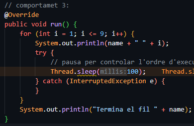
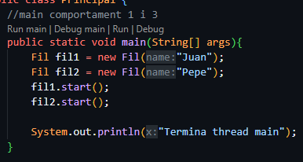
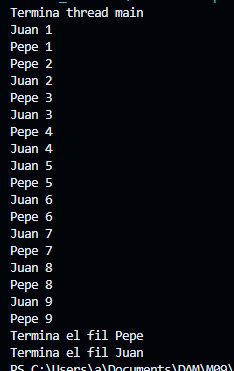

## M09-UF2
Aquesta activitat és la introducció a la programació de fils
Serveix per conèixer les bases de la multiprogramació en Java.

## Comportament 1
Juan i Pepe es vagin intercalant més o menys de forma equitativa

#### Codi per el comportament 1:

#### Resultat del codi 1:

## Comportament 2
S’executi primer majorment Pepe i després Juan en totes les execucions que facis
#### Notes
És possible que l’execució no sigui 100% l’esperada a la primera, ja que l’ordre d’execució no està garantit. 
Probablement s’hagi d’executar diverses vegades per veure el comportament al llarg de diversos intents (sempre que s’hagin establert els paràmetres correctes).
#### Codi per el comportament 2:

#### Resultat del codi 2:

## Comportament 3
Que s’executin en ordre estricte altern entre cada fil.
#### Codi per el comportament 3:
Codi Fil:

Codi Principal:

#### Resultat del codi 3:
