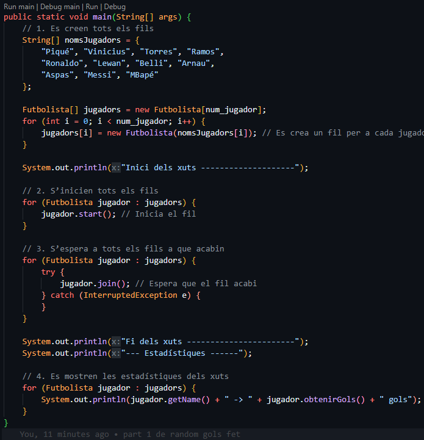

## M09-UF2
Aquesta activitat és la introducció  on es tracta de profunditzar amb la gestió de fils de Java, practicant coses com la comunicació amb els
fils.

## Part 1
### Requeriments: 
- ngols i ntirades que inicialitzen a 0 al constructor.

- ha de tenir constants

- No es pot crear una variable de classe String nova per guardar el nom del jugador (super(String) i getName()).

- Cada jugador tirarà NUM_TIRADES vegades i marcarà amb una probabilitat de PROBABILITAT de marcar, actualitzant ngols i ntirades cada vegada.

- En el mètode main:
1. Es creen tots els fils
2. S’inicien tots els fils
3. S’espera a tots els fils a que acabin
4. Es mostren les estadístiques dels xuts

### Sortida del programa:

## Part 2
- Demostra que TOTS els programes en Java s’executen en un fil.
- Es crea una classe MainDemoFil.java on es captura el fil actual en execució i mostra el nom, la prioritat i el toString() de la classe.

