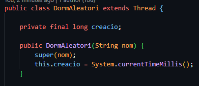
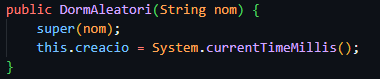
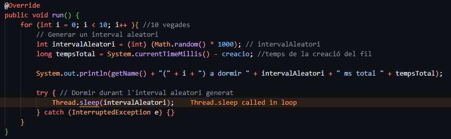
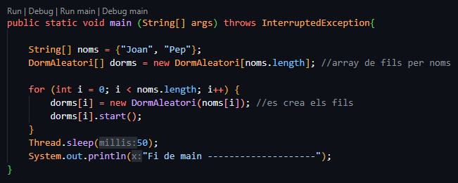
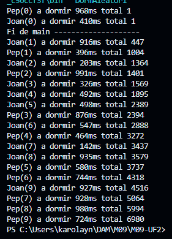

## M09-UF2
Activitat per l’ús de Sleep en una activitat específica i després implementem una simulació de motors d’un coet espacial de forma simplista.

## Part 1: Sleep
### Requeriments: 
- Crea la classe DormAleatori.java que:

S’inicialitzi amb un nom però utilitzi la variable name de Thread

Tingui constància de l’instant en que s’ha creat (no ficat en execució, sinó ha estat construïda → constructor)

En l’execució repeteixi 10 vegades:
◦ Mostrar → nom, num_iteració, interval_aleatori, total de temps des de la construcció
◦ Dormir l’interval_aleatori mostrat

Tingui un mètode principal on:
◦ Es creen dues instàncies de DormAleatori una anomenada «Joan» i l’altra «Pep» i
◦ Les fiqui en marxa.
◦ Mostri que s’acaba el mètode

### Sortida del programa:

## Part 2
Per simular processos reals, es solen construir programes informàtics que han d’emular el comportament dels sistemes que es volen simular. 
En aquest cas simularem el comportament d’un coet espacial amb 4 motors.
No tindrem en compte cap tipus de variable física més que el temps de resposta dels motors que serà aleatori.

Classe Motor.java que simuli el comportament d’un motor real de coet:
