## M09-UF2
Activitat per l’ús de Sleep en una activitat específica i després implementem una simulació de motors d’un coet espacial de forma simplista.

## Part 1: Sleep
### Requeriments: 
- Crea la classe DormAleatori.java que:

S’inicialitzi amb un nom però utilitzi la variable name de Thread

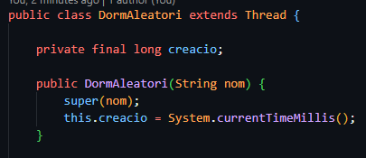

Tingui constància de l’instant en que s’ha creat (no ficat en execució, sinó ha estat construïda → constructor)

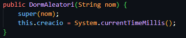

En l’execució repeteixi 10 vegades:
◦ Mostrar → nom, num_iteració, interval_aleatori, total de temps des de la construcció
◦ Dormir l’interval_aleatori mostrat

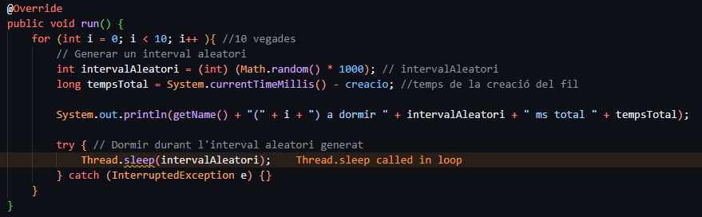

Tingui un mètode principal on:
◦ Es creen dues instàncies de DormAleatori una anomenada «Joan» i l’altra «Pep» i
◦ Les fiqui en marxa.
◦ Mostri que s’acaba el mètode

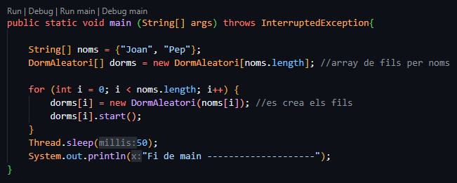

### Sortida del programa:
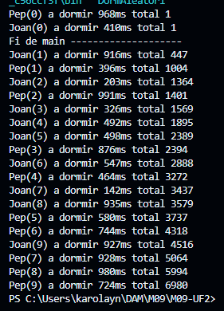

## Part 2
Per simular processos reals, es solen construir programes informàtics que han d’emular el comportament dels sistemes que es volen simular. 
En aquest cas simularem el comportament d’un coet espacial amb 4 motors.
No tindrem en compte cap tipus de variable física més que el temps de resposta dels motors que serà aleatori.

Classe Motor.java que simuli el comportament d’un motor real de coet:
• Inicialment està aturat i per tant la potència objectiu i la potència actuals són 0

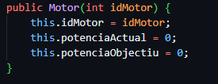

• Quan se li estableix la potència objectiu amb el setter setPotencia(int p) 

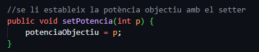

• Ha de passar de la potència actual a la objectiu en passos de 1 (incrementant o decrementant) i per
simular el comportament d’un motor real trigarà en fer-ho un interval aleatori de entre 1 i 2
segons.

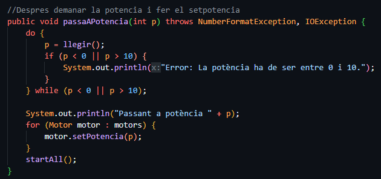

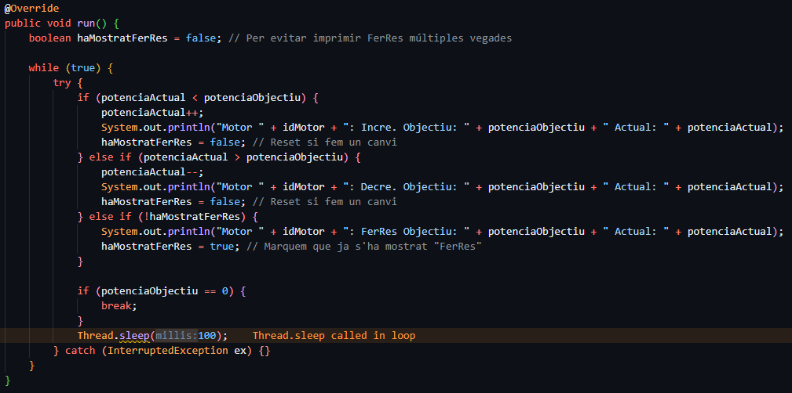

• Si la potència objectiu és 0 quan arribi a la potència 0 ha de sortir

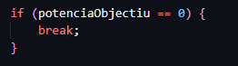

Crea també la classe Coet.java que tingui 4 motors i en ella:

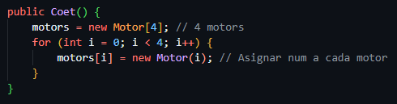

• Crea el mètode passaAPotencia(int p) que comprovi que la potència demanada és
correcta (està entre 0 i 10) i estableixi la potencia dels 4 motors a p o doni un error de valor

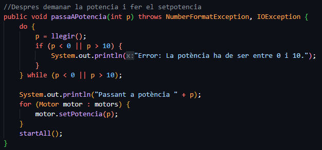

• Crea el mètode arranca (main) que llanci a funcionar els 4 motors

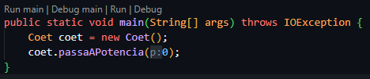

• Fes que Coet llegeixi contínuament per consola la potència objectiu i immediatament la
estableixi a tots els seus motors fins que la potència objectiu sigui 0

### Sortida del programa:
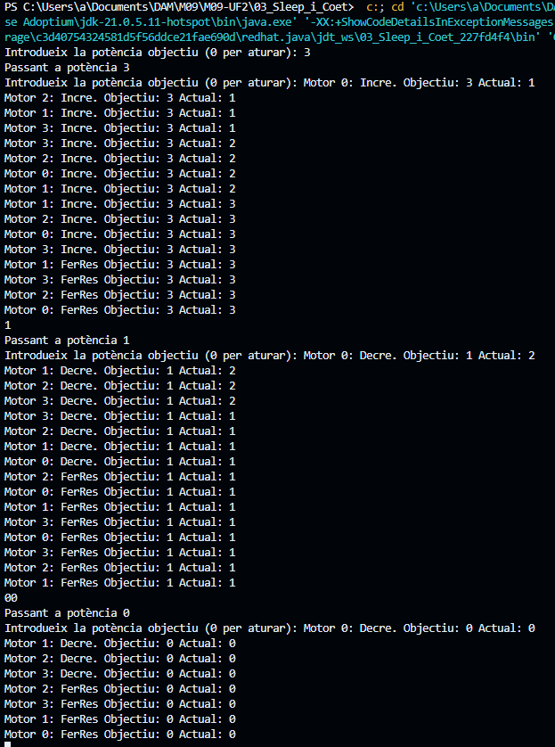