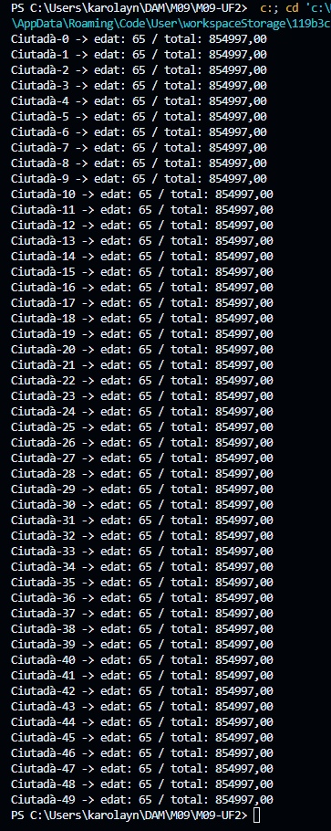

## M09-UF2
Aquesta activitat és la introducció  on es tracta de profunditzar amb la gestió de fils de Java, practicant coses com la comunicació amb els fils.

Avancem amb la clàusula join() per estudiar la necessitat de la espera fins a la fi d’un fil

Volem simular una població que durant la seva edat treballadora cobra el sou i paga impostos i
mostrar la quantitat final de diners que ha guanyat.

### Requeriments Trballador: 

- un «nou_anual_brut» que en aquesta simulació no variarà amb els anys i s’establirà al
constructor
- una «edat_inici_treball» i «edat_fi_treball» que s’establiran en el
constructor
- un nom que usarà el de Thread en el constructor
- una «edat_actual» que al constructor s’estableix a 0
- un «cobrat» que acumularà la quantitat cobrada en total al llarg del anys i al constructor
val 0.0f
- també té una variable «rnd» de tipus Random per fer servir més endavant

Mètodes:
- «cobra» que incrementa el cobrat amb una dotzena part del sou brut

- «pagaImpostos» que paga el 24% del que ha cobrat en el mes

- el mètode «run»

- els getters «getCobrat» i «getEdat»

### Requeriments Administracio: 

- un «num_poblacio_activa» de 50
- un «poblacio_activa» amb 50 treballadors

Mètodes:

- Un constructor on inicialitza els ciutadans amb un sou anual de 25000, edat d’inici de treball
de 20 i edat de fi de treball de 65

- el mètode principal on els fica en marxa i mostra les estadístiques

### Sortida del programa:

