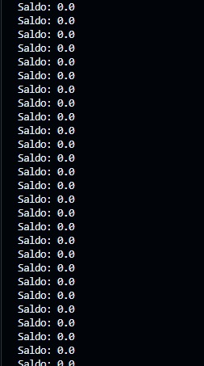

## M09-UF2
Aquesta activitat és la introducció  on es tracta de profunditzar amb la gestió de fils de Java, practicant coses com la comunicació amb els fils.

Avancem amb la directriu synchronized per estudiar la necessitat limitar l’accés a un recurs
d’un sol fil a la vegada.

Volem simular una associació que té uns socis molt enrotllats que s’avenen a ficar una aportació
mensual petita cadascú i retirar-la al mes següent per tal que l’associació pugui obtenir uns
interessos a càrrec dels socis.

Tots els socis ingressen i treuen diners el mateix compte que per seguretat implementa un patró
singleton a l’associació.

Cada soci ingressarà una quota fixa cada mes i la retirarà el mes següent. Per simular el pas del
temps el soci després de ficar o treure la quota del compte (segons el mes que sigui) esperarà un
interval de temps variable aleatori de un màxim de experaMax = 100.

### Requeriments Compte: 

- Un saldo

- el patró singleton implementat de manera que garanteixi que només existeix una instància.

- El getter i setter de saldo.

### Requeriments Soci: 

- té la instància de Compte
- la aportacio = 10f
- esperaMax=100
- Random
- maxAnys=10

- un constructor

- getter de compte

- mètode d’execució on
- s’itera al llarg dels anys que van fins a maxAnys
- s’itera al llarg dels mesos
- els mesos parells fa un ingrés de la quota i
- els mesos imparells la treu

### Requeriments Associació: 
- numSocis = 1000
- socis[]
- Un constructor

- iniciaCompteTempsSocis

- esperaPeriodeSocis

- mostraBalancComptes

### Sortida del programa:

