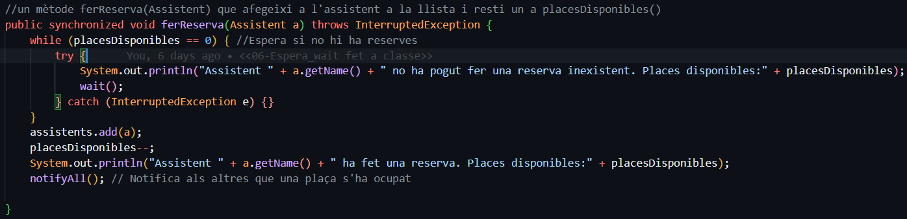
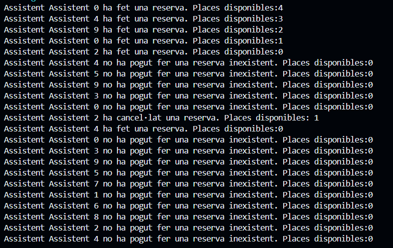
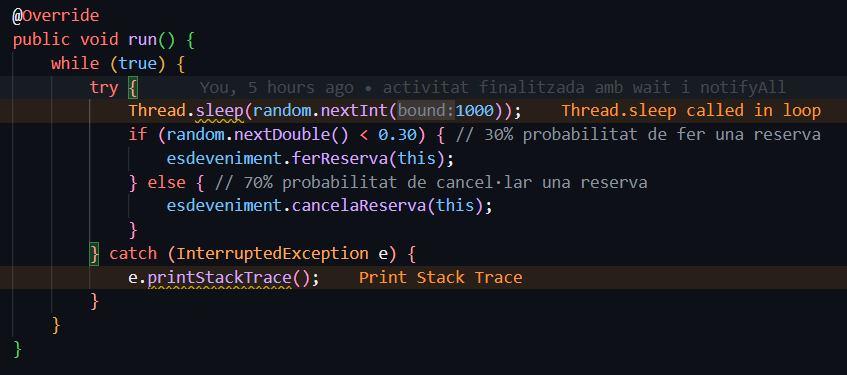
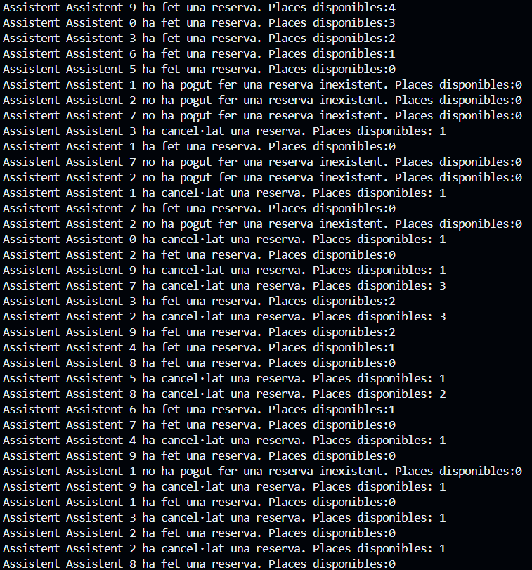

## M09-UF2
Aquesta activitat és la introducció  on es tracta de profunditzar amb la gestió de fils de Java, practicant coses com la comunicació amb els fils.

Avancem amb la directriu wait i notifyAll per estudiar la com esperar fins que algú altre et notifiqui. 

Un organitzador d'esdeveniments vol gestionar les reserves d'assistents per a un esdeveniment amb capacitat limitada. 
Cada esdeveniment té un màxim de 10 places, i els assistents poden fer reserves o cancel·lar-les. 
Quan un assistent intenta fer una reserva i no hi ha places disponibles, ha d'esperar fins que alguna es alliberi. 
De la mateixa manera, quan un assistent cancel·la una reserva, ha de notificar als altres assistents que hi ha places disponibles. 

### Requeriments Esdeveniment: 
- List<Assistent> 

- Un constructor que accepti el número de places màxim

- Un mètode ferReserva (Assistent) que afegeixi a l'assistent a la llista i resti un a placesDisponibles 

- Un mètode cancelaReserva (Assistent) que si Assistent està a la llista l'elimini i incrementi el número de places Disponibles

### Requeriments Assistent: 
- té un Esdeveniment 

- Constructor amb nom i Esdeveniment 

- En l'execució ha de executar eternament: amb 50% de probabilitat fa una reserva i amb 50% de probabilitat cancel·la una reserva,espera un temps aleatori de entre 0 i 1s.

### Requeriments Organitzador: 
- Crea un Esdeveniment amb 5 places màxim

- Crea 10 assistents

- Els inicia

### Sortida del programa:

## M09-UF2
### Preguntes teòriques
#### 1. Per què s'atura l'execució al cap d'un temps?

L'execució s'atura perquè els fils poden quedar bloquejats en wait() si no es crida notifyAll(). 
Això passa quan ningú cancel·la reserves, deixant els fils en espera indefinidament. 
Com a resultat, el programa sembla aturat perquè no hi ha activitat.

#### 2. Què passaria si en lloc de una probabilitat de 50%-50% fora de 70%  (ferReserva) -30% (cancel·lar)? I si foren al revés les probabilitats? 
##### → Mostra la porció de codi modificada i la sortida resultant en cada un dels 2 casos 
Si la probabilitat fora de 70% de ferReserva hi hauria més demandes de reserves que cancel·lacions.
Això fa que no hi hagi places disponibles. Per tant,, molts assistents quedarien bloquejats en wait() esperant una plaça lliure. 
Això podria fer que el programa s’aturi aparentment, ja que pocs fils podrien continuar executant-se.

Codi:

Resultat: Es fan les reserves però els altres no poden, ja que no les cance.len.

Per el contrari, si la posibilitat fora de 70% per cancelarReserva s’alliberarien més places del que es reserven. 
Això evitaria que els fils quedessin bloquejats en wait(), però genera que hi hagin moltes places disponibles però pocs assistents reservant-les.

Codi:

Resultat:

#### 3. Perquè creus que fa falta la llista i no valdria només amb una variable sencera de reserves? 

La llista d'assistents és necessària perquè permet saber qui ha fet la reserva, mentre que una variable sencera només diu el total. 
Sense la llista, no podríem verificar si un assistent té una reserva abans de cancel·lar-la, cosa que podria causar errors.