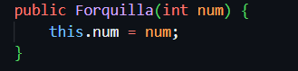
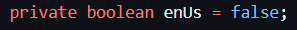
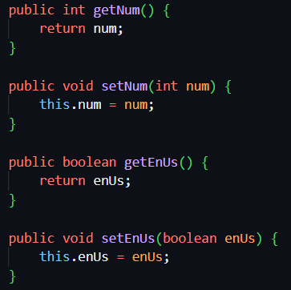
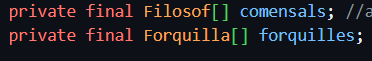
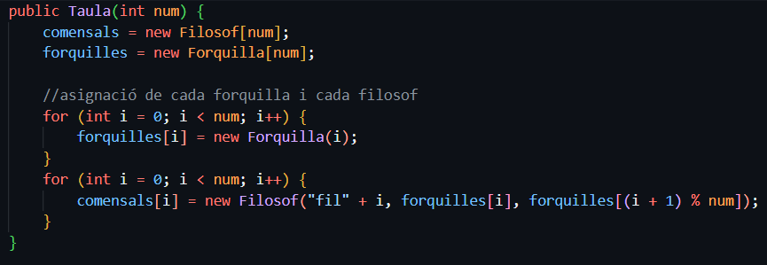
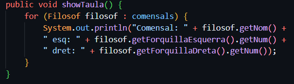
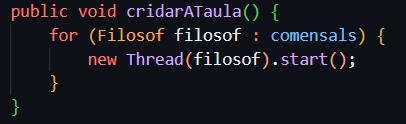

## M09-UF2
Aquesta activitat és la introducció  on es tracta de profunditzar amb la gestió de fils de Java, practicant coses com la comunicació amb els fils.

Avancem a programar una solució a un dels problemes clàssics de la la multitasca: el sopar dels filòsofs.

A una taula redona es senten uns filòsofs a sopar. La seva vida és pensar i menjar de forma alternativa. Cada un d'ells té dues forquilles (una a cada banda) i li calen les dues per poder menjar. 

Les forquilles estan compartides cada una amb el filòsof del costat forquilla esquerra és la dreta del filòsof de l'esquerra, i forquilla dreta és l'esquerra del filòsof de la dreta). 

### Requeriments Forquilla: 
- Un consturctor amb el número 

- un flag enus 

- setters i getters 

### Requeriments Taula: 
- Amb uns comensals (Filòsofs)
- Amb unes forquilles (Forquilla)

- Un constructor amb el número de filòsofs que cree els filòsofs, les forquilles i les assignacions 

- Un mètode showTaula que mostri cada filòsof i les seves forquilles 

- Un mètode cridarATaula que inicii els filòsofs de la taula 

### Requeriments Filòsof: 
- El mètode principal que mosti la taula i cridi taula 
- una forquillaDreta i una forquilla Esquerra 
- un comptador de la gana que té 
- amb un constructor amb nom 
- un mètode menjar 
- un mètode pensar 
- el mètode d'execució 

### Sortida del programa:
