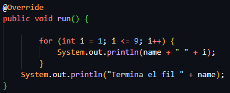
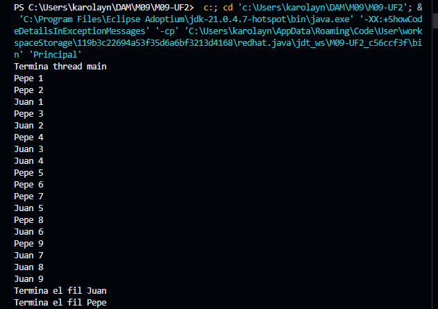

# M09-UF2
## Aquesta activitat és la introducció a la programació de fils
## Serveix per conèixer les bases de la multiprogramació en Java.

## Comportament 1
#### Juan i Pepe es vagin intercalant més o menys de forma equitativa

#### Codi per el comportament 1:

#### Resultat del codi:

